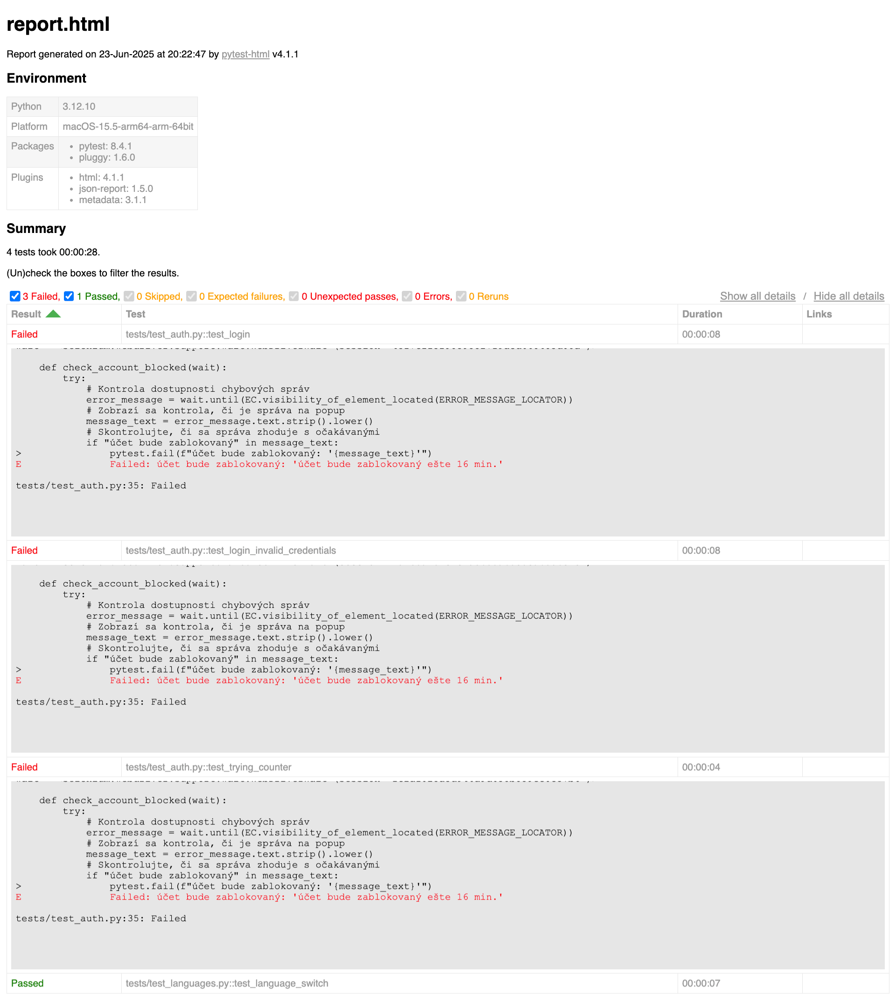

# Automatizované testovanie aplikácie Biometric

Tento projekt obsahuje automatizované testy pre webovú aplikáciu [https://demo.biometric.sk](https://demo.biometric.sk) pomocou knižnice `selenium` a `pytest`.

---

## Možnosť 1: Testovanie prihlásenia do aplikácie

### Test Case 1A – Úspešné prihlásenie do systému

**Predpoklad:**  
Používateľ je na stránke: https://demo.biometric.sk/

**Kroky:**
1. Zadať prihlasovacie meno do poľa **Meno / ID**
2. Zadať heslo do poľa **Heslo**
3. Kliknúť na tlačidlo **Prihlásiť**

**Očakávaný výsledok:**  
Používateľ bude presmerovaný na Dashboard:  
https://demo.biometric.sk/Pages/Dashboard

---

### Test Case 1B – Neúspešné prihlásenie

**Cieľ:**  
Overiť, že systém správne reaguje na neplatné prihlasovacie údaje.

**Kroky:**
1. Zadať neplatné používateľské meno alebo heslo
2. Kliknúť na tlačidlo **Prihlásiť**

**Očakávaný výsledok:**  
- Používateľ zostane na prihlasovacej stránke
- Zobrazí sa chybové hlásenie s informáciou o nesprávnych údajoch

---

### Test Case 1C – Extra test - Neúspešné prihlásenie niekoľko pokusov

**Cieľ:**  
Overiť, či sa zakaždým zníži počet pokusov.

**Kroky:**
1. Zadať neplatné heslo
2. Kliknúť na tlačidlo **Prihlásiť**
3. Opakovať so rovnakým používateľským menom

**Očakávaný výsledok:**
- Používateľ zostane na prihlasovacej stránke
- Zobrazí sa chybové hlásenie s informáciou o nesprávnych údajoch
- Počet zostávajúcich pokusov sa zníži

---

## Možnosť 2: Testovanie jazykových mutácií

**Cieľ:**  
Overiť, že prepínanie jazykových verzií (sk, en, cz) funguje správne.

**Kroky:**
1. Prepnúť jazyk kliknutím na príslušný jazykový odkaz
2. Overiť, že:
   - Placeholdery a texty na stránke sa zmenia podľa zvoleného jazyka
3. Obnoviť stránku
4. Overiť, že jazyková mutácia zostala zachovaná

---

## Spustenie testov

1. Nainštalujte virtuálne prostredie
```bash
python3 -m venv venv
```

2. Aktivuj virtuálne prostredie:
```bash
source venv/bin/activate
```

3. Nainštaluj závislosti:
```bash
pip install -r requirements.txt
```

4. Spusť testy:

   S GUI
```bash
pytest tests/ --verbose -s
```

   Bez GUI:
```bash
HEADLESS=1 pytest tests/ --verbose -s
```

---

## 🔍 Prečo som si vybral Pytest a Selenium

### Selenium
Selenium je overený a široko používaný nástroj na testovanie webových aplikácií. Vybral som ho preto, že:

- Umožňuje **realistickú interakciu s webovou stránkou**, ako to robí skutočný používateľ (zadávanie údajov, klikanie, overovanie textu).
- Podporuje **všetky hlavné prehliadače** (Chrome, Firefox, Edge), čo je dôležité pre testovanie kompatibility.
- Má rozsiahlu dokumentáciu a komunitu.

### Pytest
Pytest som zvolil ako testovací rámec, pretože:

- Je **jednoduchý na použitie** – testy sú prehľadné, čitateľné a rýchlo sa píšu.
- Podporuje **fixtures**, ktoré zjednodušujú opakované nastavenia (napr. inicializácia prehliadača).
- Má silnú integráciu s CI/CD nástrojmi (GitHub Actions, GitLab CI atď.).
- Výsledky testov sú **prehľadné a dobre logované**.

---

## Integrácia s CI/CD

Tieto testy sú integrované v CI pipelinu (GitHub Actions). Spúšťajú sa automaticky pri každej zmene v hlavnej vetve (`main`).  
To zabezpečuje, že každá zmena v kóde je automaticky overená a neporušuje existujúcu funkcionalitu.

---

### Uloženie reportov (lokálne)

Ak si želáte uložiť výsledky testov do formátu HTML a JSON lokálne, použite:

```bash
HEADLESS=1 pytest tests/ --verbose -s --json-report --html=report.html
```

Výsledky sa uložia do súborov:
- `report.html` – prehľadný vizuálny report otvoriteľný v prehliadači
- `report.json` – strojovo čitateľný výstup vhodný pre integráciu s inými nástrojmi



---

### Notifikácie do Slacku

Je možné nastaviť notifikácie o výsledkoch testov priamo do aplikácie Slack pomocou GitHub Actions.  
Napríklad, ak testy zlyhajú alebo prebehnú úspešne, do vybraného Slack kanála sa automaticky odošle správa.

Konfigurácia pre `tests.yml`:

```yaml
- name: Notifikácia do Slacku pri neúspešných testoch
  if: failure()
  uses: slackapi/slack-github-action@v1.24.0
  with:
    payload: |
      {
        "text": ":x: Testy zlyhali v `${{ github.workflow }}` na branche `${{ github.ref_name }}`\n<${{ github.server_url }}/${{ github.repository }}/actions/runs/${{ github.run_id }}|Zobraziť výsledky>"
      }
  env:
    SLACK_WEBHOOK_URL: ${{ secrets.SLACK_WEBHOOK_URL }}

- name: Notifikácia do Slacku pri úspešnom prechode testov
  if: success()
  uses: slackapi/slack-github-action@v1.24.0
  with:
    payload: |
      {
        "text": ":white_check_mark: Všetky testy prebehli úspešne v `${{ github.workflow }}` na branche `${{ github.ref_name }}`"
      }
  env:
    SLACK_WEBHOOK_URL: ${{ secrets.SLACK_WEBHOOK_URL }}
```
---

### 📧 Odosielanie reportov e-mailom

Okrem Slacku je možné zasielať testovacie reporty aj priamo na e-mail vo forme príloh (napr. `report.html` a `report.json`).

#### Konfigurácia pomocou GitHub Actions

1. Pridajte do `tests.yml` nasledovný krok po spustení testov:

```yaml
- name: Odoslanie reportu e-mailom
  uses: dawidd6/action-send-mail@v3
  if: always()
  with:
    server_address: smtp.gmail.com
    server_port: 465
    username: ${{ secrets.EMAIL_USERNAME }}
    password: ${{ secrets.EMAIL_PASSWORD }}
    subject: 📋 Výsledky testov z GitHub Actions
    to: ${{ secrets.EMAIL_TO }}
    from: Automatizovaný Testovací Systém
    secure: true
    body: |
      Zdravím tím,

      V prílohe nájdete výsledky posledného spustenia testov z CI pipeline.

      Workflow: ${{ github.workflow }}
      Commit: ${{ github.sha }}
      Dátum: ${{ github.event.head_commit.timestamp }}

      S pozdravom,  
      Testovací bot
    attachments: report.html,report.json
```

2. V repozitári uložte nasledovné tajomstvá (`Settings → Secrets → Actions`):
   - `EMAIL_USERNAME`: e-mailová adresa odosielateľa (napr. `ci-bot@test.sk`)
   - `EMAIL_PASSWORD`: heslo alebo app password
   - `EMAIL_TO`: cieľová e-mailová adresa (napr. `test@test.sk`)

---

## Štruktúra priečinkov

```
autotesting/
│
├── tests/               # Obsahuje testovacie súbory
├── venv/                # Virtuálne prostredie
├── requirements.txt     # Zoznam závislostí
└── README.md            # Tento súbor
```

---


## 🧑‍💻 Autor

Sergei Sokov – 2025